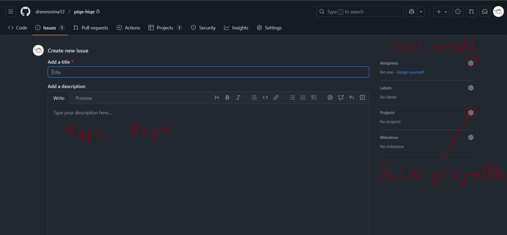
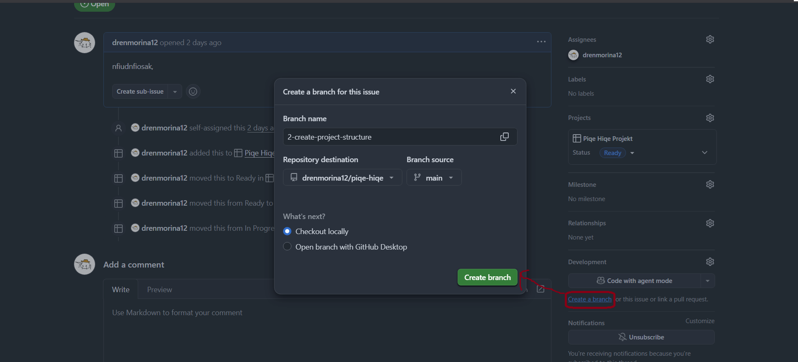

# ✌️ Contributing Guide

Here is a guide so everyone is on the same page.

You can find setup instructions in the README file.

---

## 🪄 Issue Workflow

Here’s how we’ll go from idea ➜ code ➜ finished feature.

1. **Create an Issue**
   - Go to the project repository: https://github.com/drenmorina12/piqe-hiqe
   - Go to the GitHub “Issues” tab.
   - Click **New Issue**.
   - Add a title, like:  
     `Add login page` or `Fix layout spacing on home screen`.
   - Add a short description of what needs to be done.
   - Create it.

   

2. **Assign the Issue (Optional)**
   - You can optionally assign the issue to yourself so others know you’re on it.
   - (Optional) Add relevant labels if needed (like `bug`, `enhancement`, etc).

3. **Create a Branch**
   - After clicking on an issue, on the right side, you can se a **Development** seciton. Click **create branch** and create branch with the dafault name. After that copy the code it shows to your terminal.

   

4. **Work on It**
   - Write your code and make sure everything runs properly.
   - Keep commits small and focused on one thing at a time.

5. **Commit Your Changes**
   - (Optional) Commit messages should be short and clear, e.g.:
     ```
     fix: align button in login screen
     feat: add new activity type form
     ```

6. **Push and Create a Pull Request (PR)**
   - Push your branch.
     ```
     git push origin <branch name>
     ```
   - Open a **Pull Request**.
   - Write a short summary of what you did.

7. **Review & Merge**
   - Someone reviews the PR and suggests changes if needed.
   - Once approved, it gets merged into `main` and auto closes the issue.

---

## 🗂️ Folder Structure

Here’s how the project is organized:

```
app/          → main app screens (each screen in its own folder)
assets/       → images, icons, fonts, etc.
components/   → reusable UI parts (buttons, cards, etc.)
config/       → app-wide configuration (API setup, constants, etc.)
constants/    → static values like colors, route names, etc.
hooks/        → custom React hooks
scripts/      → automation or build scripts
utils/        → helper functions and utilities
```

---

## ✍️ Naming Conventions

- **Files and Folders:**  
  Use lowercase with hyphens for regular files (e.g. `user-card.jsx`, `auth-utils.js`).  
  Use PascalCase for React components (e.g. `LoginScreen.jsx`, `CustomButton.jsx`).

- **Components:**  
  Each component lives in its own file.  
  If a screen has multiple parts, feel free to create a small subfolder inside `components/` or under `app/ScreenName/`.

- **Variables and Functions:**  
  Use `camelCase` (e.g. `handleLogin`, `userData`).

---

## 🧩 Optional: Git Conventions (For Consistency)

If you want to follow a cleaner commit and branch naming style, here’s the structure we’ll use:

### Commit Messages

```
feat: add new login component
fix: adjust time input field alignment
refactor: clean up home screen layout
chore: update dependencies
```

Nothing too strict - just helps keep the history readable.

---

## 💬 Need Help?

If anything’s unclear, feel free to ask in the group — don’t get stuck!

---
